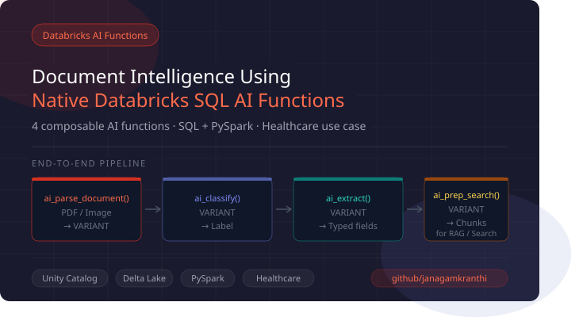

# 🤖 Databricks AI Functions — Document Processing Demo



A practical notebook for building intelligent document processing pipelines using Databricks SQL AI Functions. Demonstrates how to parse, classify, extract, and prepare documents for semantic search using native SQL and PySpark — no external ML frameworks required.

[](https://databricks.com)
[](https://spark.apache.org)
[](https://python.org)

---

## 📋 Overview

This notebook covers **4 AI functions** that work together to transform unstructured documents (PDFs, images) into structured, searchable data:

| Function | Purpose | Input | Output |
|---|---|---|---|
| `ai_parse_document()` | Extract content from documents | Binary files | Structured `VARIANT` |
| `ai_classify()` | Categorize documents | `VARIANT` / String | Document labels |
| `ai_extract()` | Pull specific fields | `VARIANT` / String | Typed structured data |
| `ai_prep_search()` | Prepare for semantic search | `VARIANT` | Semantic chunks |

---

## ✨ Key Features

- **📄 Document Parsing** — Extract text, tables, and figures from PDFs and images
- **🏷️ Auto-Classification** — Categorize documents into custom labels
- **🔍 Smart Extraction** — Pull specific fields with type validation
- **🔎 Search Preparation** — Create semantic chunks for vector search & RAG
- **🔗 Function Chaining** — Output of one function feeds directly into the next
- **⚡ Dual Syntax** — Every example shown in both SQL and PySpark
- **💾 Production Ready** — Results persisted to Delta tables

---

## 🎯 Use Case: Healthcare Document Processing

This demo processes medical documents including patient records, prescriptions, lab reports, insurance forms, and consent forms.

Structured fields extracted:

- Patient name and ID
- Dates of service
- Diagnoses
- Medications (name, dosage, and frequency)
- Provider contact information

---

## 🚀 Quick Start

### Prerequisites

- Databricks workspace (AWS / Azure / GCP)
- Unity Catalog enabled
- Serverless SQL Warehouse or cluster with DBR 14.0+
- Documents stored in a Unity Catalog Volume

### Setup

1. **Upload your documents** to a Unity Catalog Volume:

   ```
   /Volumes/<catalog>/<schema>/raw_documents/
   ```

2. **Update the volume path** in the notebook parameters

3. **Run cells sequentially** — each section builds on the previous output

---

## 💡 Usage Examples

### 1. Parse Documents

```sql
SELECT
  path,
  ai_parse_document(content, MAP('version', '2.0')) AS parsed_content
FROM READ_FILES('/Volumes/<catalog>/<schema>/raw_documents/', format => 'binaryFile')
```

---

### 2. Classify Documents

```sql
SELECT
  ai_classify(
    parsed_content,
    '{
      "patient_record": "Medical records, patient history",
      "prescription":   "Medication prescriptions",
      "lab_report":     "Lab results and diagnostics"
    }',
    MAP('version', '2.0')
  ) AS document_type
FROM parsed_docs
```

---

### 3. Extract Structured Fields

```sql
SELECT
  ai_extract(
    parsed_content,
    '{
      "patient_name": { "type": "string", "description": "Full name" },
      "patient_id":   { "type": "string", "description": "Medical record number" },
      "medications": {
        "type": "array",
        "description": "Prescribed medications",
        "items": {
          "type": "object",
          "properties": {
            "name":   { "type": "string" },
            "dosage": { "type": "string" }
          }
        }
      }
    }',
    MAP('version', '2.0')
  ) AS extracted_data
FROM parsed_docs
```

---

### 4. End-to-End Pipeline

Parse → Classify → Extract → Prep Search in a single chained query:

```sql
WITH parsed_docs AS (
  SELECT
    path,
    ai_parse_document(content, MAP('version', '2.0')) AS parsed_content
  FROM READ_FILES('/Volumes/<catalog>/<schema>/raw_documents/', format => 'binaryFile')
)
SELECT
  path,
  ai_classify(parsed_content, '{...}', MAP('version', '2.0'))  AS document_type,
  ai_extract(parsed_content, '{...}', MAP('version', '2.0'))   AS extracted_fields,
  ai_prep_search(parsed_content)                               AS search_chunks
FROM parsed_docs
```

---

## 📂 Notebook Structure

1. **Introduction** — Overview and environment setup
2. **`ai_parse_document()`** — Document parsing (SQL + PySpark)
3. **`ai_classify()`** — Document classification (SQL + PySpark)
4. **`ai_extract()`** — Field extraction with schemas (SQL + PySpark)
5. **`ai_prep_search()`** — Search preparation (SQL + PySpark)
6. **End-to-End Pipeline** — Full chained workflow
7. **Persistence** — Writing results to Delta tables
8. **Analytics** — Querying and validating processed documents

---

## 🎓 Best Practices

- Always use `MAP('version', '2.0')` for optimal model results
- Pass `VARIANT` directly between functions — avoid flattening to text
- Use `READ_FILES` with `format => 'binaryFile'` for document ingestion
- Add descriptions to labels and schema fields for better extraction accuracy
- Chain functions using CTEs for readable, maintainable pipelines
- Persist intermediate results to Delta tables for reusability and auditability

---

## 🛠️ Technologies

| Technology | Role |
|---|---|
| Databricks SQL | Serverless query engine |
| Apache Spark | Distributed processing |
| Unity Catalog | Data governance and volume storage |
| Delta Lake | Reliable, versioned data storage |
| Databricks AI Functions | Built-in document intelligence |

---

## 📊 Real-World Applications

- **Healthcare** — Medical records, insurance claims, lab reports
- **Finance** — Invoices, contracts, bank statements
- **Legal** — Contracts, briefs, compliance documents
- **HR** — Resumes, applications, onboarding forms
- **Customer Service** — Support tickets, feedback, surveys
